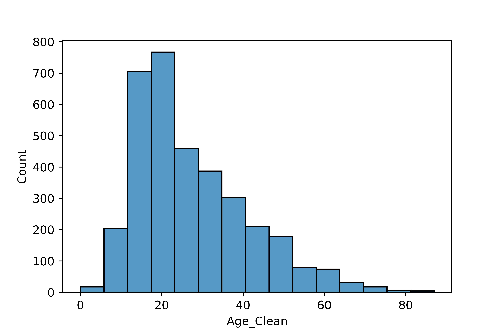
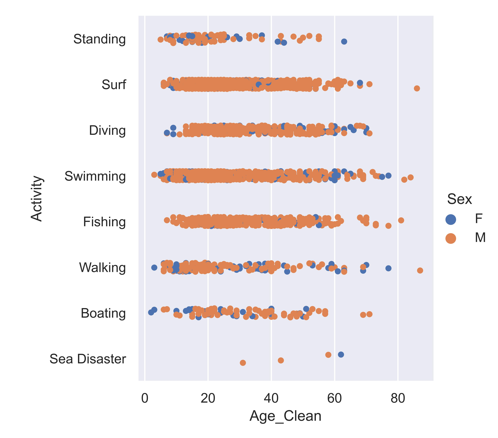
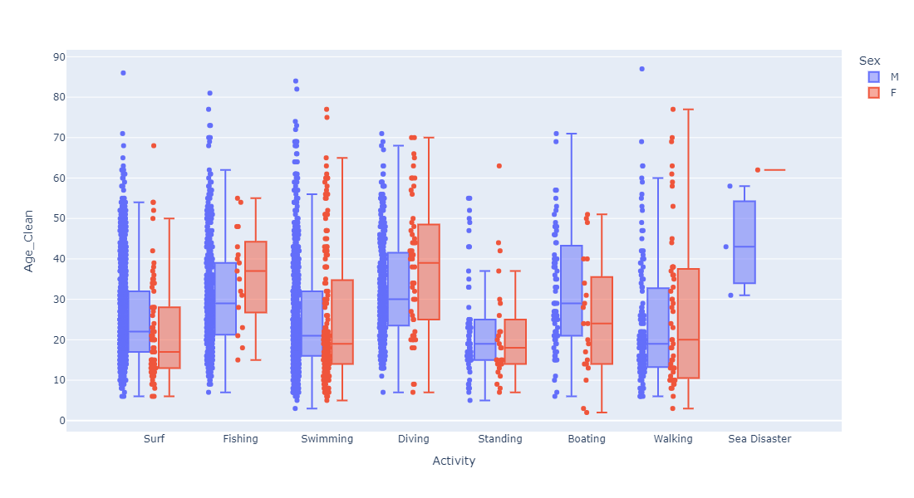
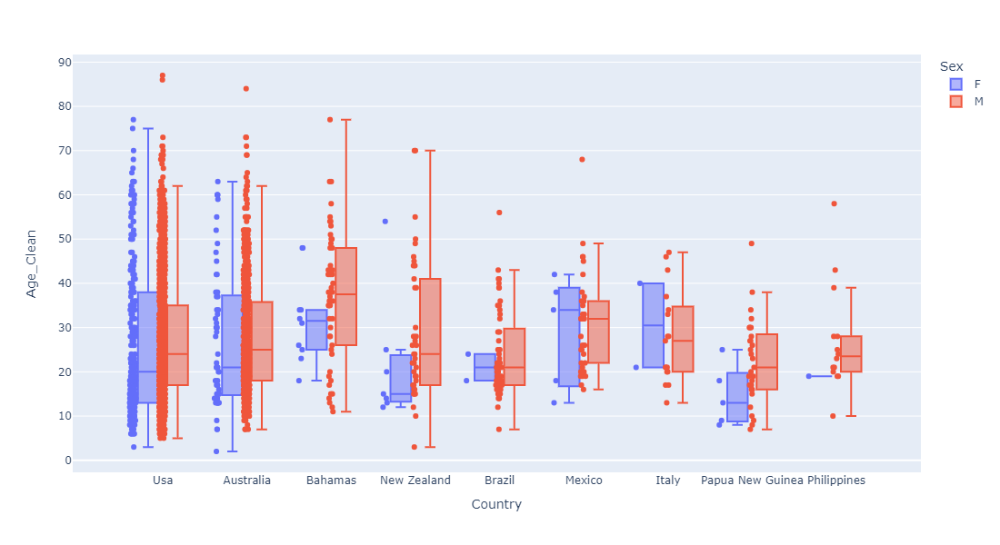
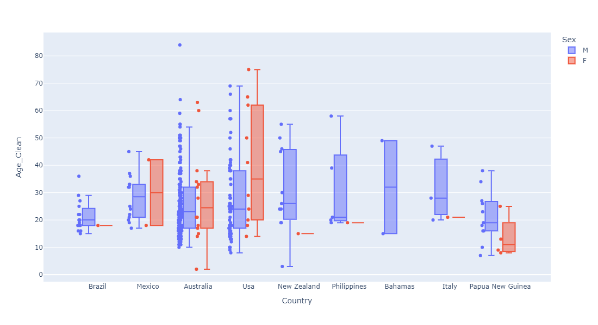

#

# My Project
## Shark Attacks 
### By: Edgard Cuadra
### Date: July 18th 2022

#

## Hypothesis:
#

Is there a corrolation of attacks depending on your sex, age, activity and country. would you have to have precautions whenever visiting specific countries and doing a set of activities depending on your age?

#
## Data Cleaning:
#

in the EDA file the Sharkattack file was imported
this file had a shape of 25,723 rows and 24 columns. 
the column "original order" cointains a unique value for every case.

when evaluating it was shown that 76% of the 25k rows had no entry whatsoever.
thus we proceeded to drop all the null values leaving a new data frame with
the shape of 6309 rows that. 

now that we have only the rows with information we can proceed to determin how each column is composed and how many missing values there is in each column.

        Case Number                0.011490%
        pdf                        0.110953%
        href formula               0.126803%
        Case Number.1              0.110953%
        Case Number.2              0.110953%
        Date                       0.110953%
        Unnamed: 22               99.984150%
        Unnamed: 23               99.968299%

The columns listed above are columns that bring no value to proving our hypothesis, thus we proceeded to drop all the columns and used the remaining for our investigation.

i proceede to examine every variable and determined what needed to be done in order to clean each variable.

the column **href** has less than 1% missing values and the date is included inside the files name which wour allow to use regex and extract only the values that are dates and store them in new columns: (Year,Month,Day)

example:

    href 0.110953%

    Random row:
    http://sharkattackfile.net/spreadsheets/pdf_directory/2018.06.25-Wolfe.pdf

the column **original order** is a unique regestry that does not repeat, making it a good choice to become the index of the dataframe.

for the variables **Type,Sex and Fatal (Y/N)** are partialy clean by looking at the unique values it show that there are typo error thus we can use a replace function to substitute the typo values with the correct values:

Missing values in cells: 

        Type                       0.174354%
        Sex                        9.066413%
        Fatal (Y/N)                8.654303%

Replace function:

        def Replace (df,column,source,output):
            s = source
            o = output
            c = column
            df[c] = df[c].replace([s],[o])
            pass

for the variables **Country, Activity)** the information was dirties and harder to be able lo clean for this case the information was cleanes using for loop to replace key words for the category that we want to simplify. made some aditional cleaning by using tittle() to have the propper capitalization in the text.

Missing values in cells: 

        Country                    0.903471
        Activity                   8.733555
        Age                       44.983357

now that i have the variables are clean and usefull we can proceed to analize the information and examine what the information contributes to our hipothesis if it proves or disproves it. 

#
## Findings:
#

With a clean database we started to check for information that can help us determin wheter there is precausions to be takend depending on diferent factors when going to the sea at any location.

first lets se what is the age distributions or our data, it seems that there is a clear skew to the left int the histogram of age. according the the following graph, **there is higher propensity to get attacked if you are in ages between 15 and 40**

Nowing that there is more proclivity to get attack with a younger ager lets see the distribution acording to activities. the distribution of activities such ase **Surfing, Diving, Swimming and Fishing** have greater density of attacks in a wider range of age that it does for **Surfing, Boating or Walking**. see following graph:

if we observe the incidents over time by activity we can see that some activities have become more popular over time thus having an increase of shark attacks, in the graph bellow we can see that some activities started to be practiced in mid 1800 and as this activities became more popular we see the apperance of more attacks acording to the reported info:

from the late 1950s to date there has been a significant **increase of attacks to surfers**, that could be corrolated to the popularity of the sport. **swimming and fishing** are the other activities that show an increase of attacks over time.

we can also see that activities such as **Surfing and Swimming** tend to have more **incidents in younger people between the ages 0r 15 and 40**

Starting in the 1900s the incidents have gone up as well as the lethality non the less since 1960s lethality have stagnated and have slowed down since the 1980s:

if we observe the fatality of this activities for the year we can observe that swimming is the riskiest activity to be doing at the sea, since the 1800s its the activity with most casualties. note that since the 1900s **Surfing, Diving and Fishing** also have a significant increase of deaths and that **Boating** used to be dangerous in the 1800s and since the 1920S casualties have gone down, see graph bellow:

Starting in the 1900s the incidents have gone up as well as the lethality non the less since 1960s lethality have stagnated and have slowed down since the 1980s:

If we check the incidence by sex we can see that the **attacks are more frequent in young adult males than females**:

The shark attack on men have started since the 1800s and for woman, they have started to increase starting 1920s but **its significantly lower the attacks on woman than males**, see graph bellow:

Looking deeper into male and female attacks if we check lethality there is a stron skew towards man, **not only the men have more attacks there are also much more deadly than for woman**:

The following graphs display the how the incidents distribute by country, showing that **Surfing and Swimming** have the most incidents reported in the countries **USA and Austrailia**, **USA** having the most incidents:

Despite **USA** having the mos incidents, data shows the the attacks in **Austrailia** are deadlier than any other country specially if you are **Swimming or Diving**:

If we examine the information by the sex of the victim we can observe that **for Men is more dangerous to Swim, Dive and surf and austrailia** and **for woman swimming in Austrailia or USA** are the deadliest activities:

Lets see this in a box plot with a distribution of age:

it is more likely for men between ages 15 and 40 to get attacked if doing the activieties such as **Surfing, Fishing, Diving or Swimmig** in no specific order, but out this activities the deadliest ones being **Swimming and Surfing**. in the case of woman its more likely to get attaked if they are between the ages of 15 and 25 and while doing the activieties such as **Swimming and Surfing** in no specific order, but out this activities the deadliest ones being **Swimming**:

Shark Attacks:

Lethal Shark Attacks:

in case of the countries it is more likely to get attacked in the united states yet it is much more deadly if you are doing activities in Austrailia this applies for both sexes: 

Shark Attacks:

Lethal Shark Attacks:

#
## Conclusion and Recomendations:
#

If you are a Male between the ages of 15 and 40 yeasr of age when visiting Austrailia and USA be carefull when doing the following activities from most dangerous to least: 

1.Surfing 
2.Diving 
3.Swimming 
4.Fishing 

If you are a Female between the ages of 15 and 25 yeasr of age when visiting Austrailia and USA be carefull when doing the following activities from most dangerous to least: 

1.Swimming 
2.Surfing 
